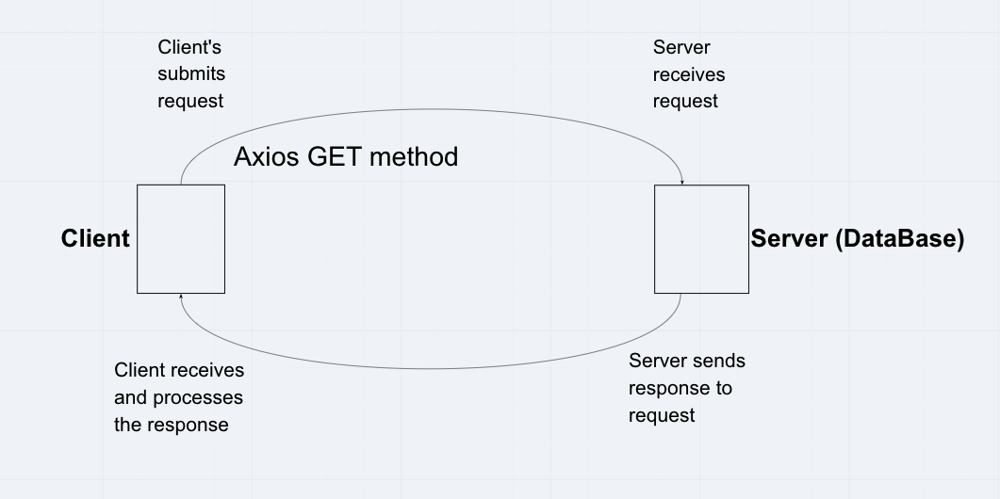

# City Explorer- 4/7/2021    

**Author**: Wenhao Piao   
**Keyword: Asynchronous code, and APIs**   
**Version**: 1.0.0    

## Overview
This app allows users to enter the name of a location and displays the location's exact latitude and longitude and static map.    

## Getting Started
1. Clone this repo.   
2. `npm i` to install all required dependencies.    
3. `npm start` to start the app.

## Architecture
This app uses `React` for front-end development and uses `axios` to make API call and uses Netlify for deployment.    

## Change Log
It took me 1 hour to complete this app.    

## Credit and Collaborations    
* Collaborator - Anthony Williams   
* Web request-response cycle diagram    

## Live Site URL    
* [City Explorer Front-end](https://affectionate-snyder-4a925f.netlify.app/)
* [City Explorer Back-end](https://city-explorer-api-wp.herokuapp.com/)